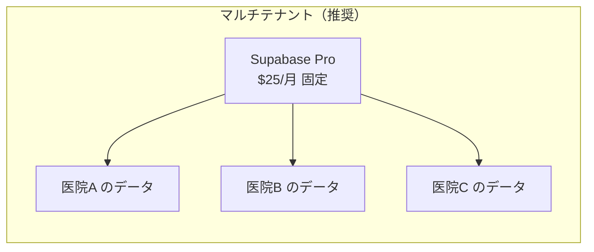
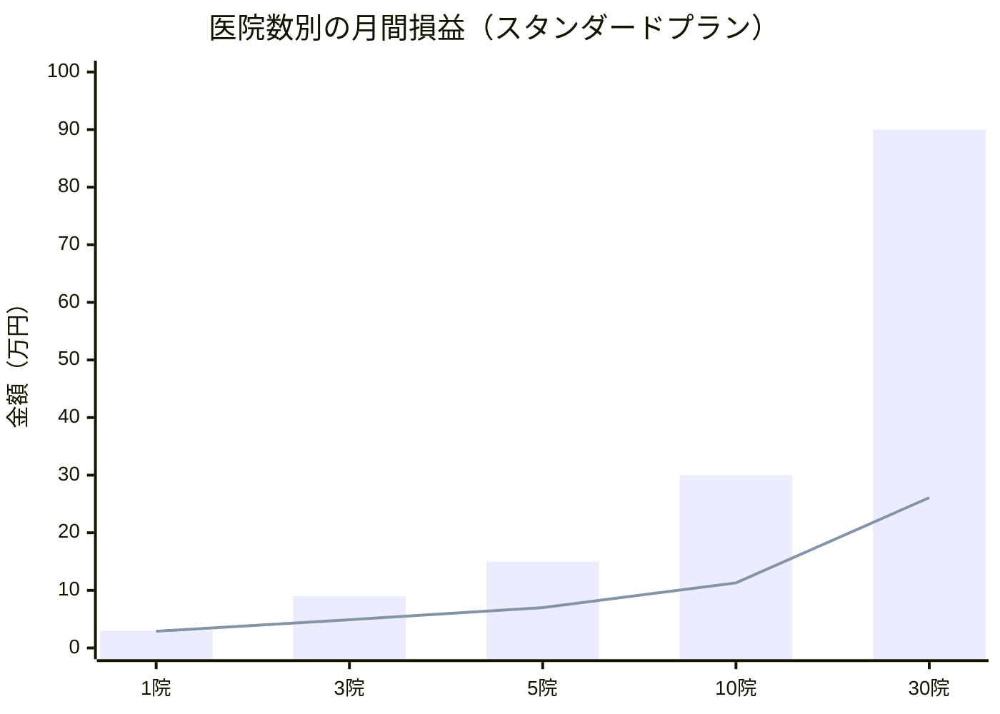
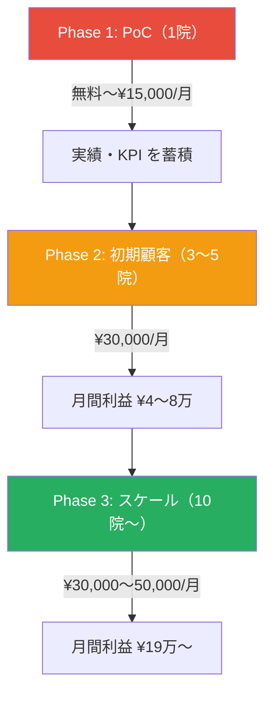

# 往診ルート最適化システム — ビジネスモデル・コスト利益分析

## 📋 前提

- **あなた（開発者）** がフリーランスとしてシステムを開発・運営
- 医院にサービスを提供し、**API費用 + 利益** を載せた月額利用料を請求
- 1医院での PoC → 複数医院へスケール

---

## 1. アーキテクチャ選択がコストを決める

複数医院に展開する際、**マルチテナント** vs **シングルテナント** の選択が月額コストに直結します。

| 方式 | 説明 | 医院あたりコスト | 推奨 |
|------|------|----------------|------|
| **マルチテナント（共有DB）** | 1つの Supabase プロジェクト内で、RLS（行レベルセキュリティ）で医院ごとにデータを分離 | **安い（スケールするほど割安）** | ✅ 推奨 |
| **シングルテナント（個別DB）** | 医院ごとに Supabase プロジェクトを作成 | **高い（医院数 × $25〜）** | ❌ 非推奨 |

> [!IMPORTANT]
> **マルチテナント一択です。** Supabase Pro 1プロジェクト（$25/月）の中に全医院のデータを入れ、PostgreSQL の RLS で分離すれば、医院が増えてもインフラ代はほぼ変わりません。

---

## 2. コスト構造の分解

### 固定費（医院数に関係なく発生）

| 項目 | 月額 | 備考 |
|------|------|------|
| Supabase Pro | **¥3,750** | 1プロジェクトで全医院をカバー |
| Vercel（フロント） | **¥0〜3,000** | Free枠で十分。Pro は $20/月 |
| ドメイン | **¥100** | 年額¥1,200÷12 |
| **固定費合計** | **約 ¥4,000〜7,000/月** | |

### 変動費（医院が増えると増加するもの）

| 項目 | 単価 | スケールの仕方 |
|------|------|--------------|
| **Google Maps API** | ¥0.7〜1.5/リクエスト | 医院数 × 医師数 × 患者数 に比例 |
| **Supabase 超過** | DB: $0.125/GB, 転送: $0.09/GB | 大量データ時のみ |
| **あなたの保守工数** | 時給ベース | 問合せ・カスタマイズ対応 |

#### Google Maps API コスト早見表

| 医院数 | 医師総数 | 1日の患者数 | Distance Matrix 要素/月 | 月額API費 |
|--------|---------|-----------|----------------------|---------|
| 1院 | 3名 | 30人 | 約 9,000 | **¥0**（無料枠内） |
| 3院 | 10名 | 100人 | 約 30,000 | **¥7,500** |
| 5院 | 15名 | 150人 | 約 45,000 | **¥13,000** |
| 10院 | 30名 | 300人 | 約 90,000 | **¥30,000** |
| 30院 | 90名 | 900人 | 約 270,000 | **¥95,000** |

> [!NOTE]
> **Google Maps API が最大のコストドライバー。** 医院数よりも「医師数 × 患者数」で決まります。キャッシュ戦略（同じルートを毎日再計算しない）で大幅に削減可能。

---

## 3. 月額利用料の価格設定

### 3パターンの価格戦略

| プラン | 月額（医院あたり） | ターゲット |
|--------|------------------|----------|
| **ライト** | **¥15,000/月** | 医師2〜3名の小規模クリニック |
| **スタンダード** | **¥30,000/月** | 医師5〜10名の中規模クリニック |
| **プレミアム** | **¥50,000/月** | 医師10名以上 + カスタマイズ対応 |

> [!TIP]
> **競合 ZEST の価格は非公開（要問合せ）** ですが、類似の医療SaaSは月額3〜10万円/院が相場。**¥15,000〜50,000** は競争力のある価格帯です。

---

## 4. 医院数別の損益シミュレーション

### スタンダードプラン（¥30,000/月）の場合

| | **1院（PoC）** | **3院** | **5院** | **10院** | **30院** |
|---|---|---|---|---|---|
| **売上** | ¥30,000 | ¥90,000 | ¥150,000 | ¥300,000 | ¥900,000 |
| |||||
| **固定費** | | | | | |
| Supabase Pro | ¥3,750 | ¥3,750 | ¥3,750 | ¥3,750 | ¥7,500 |
| Vercel | ¥0 | ¥0 | ¥3,000 | ¥3,000 | ¥3,000 |
| ドメイン等 | ¥100 | ¥100 | ¥100 | ¥100 | ¥100 |
| **固定費小計** | ¥3,850 | ¥3,850 | ¥6,850 | ¥6,850 | ¥10,600 |
| |||||
| **変動費** | | | | | |
| Google Maps API | ¥0 | ¥7,500 | ¥13,000 | ¥30,000 | ¥95,000 |
| Supabase 超過 | ¥0 | ¥0 | ¥0 | ¥1,500 | ¥5,000 |
| 保守工数（5h/院） | ¥25,000 | ¥37,500 | ¥50,000 | ¥75,000 | ¥150,000 |
| **変動費小計** | ¥25,000 | ¥45,000 | ¥63,000 | ¥106,500 | ¥250,000 |
| |||||
| **総コスト** | **¥28,850** | **¥48,850** | **¥69,850** | **¥113,350** | **¥260,600** |
| **営業利益** | **¥1,150** | **¥41,150** | **¥80,150** | **¥186,650** | **¥639,400** |
| **営業利益率** | **3.8%** | **45.7%** | **53.4%** | **62.2%** | **71.0%** |

> **保守工数**: あなたの時給 ¥5,000 × 5時間/院/月 と仮定。院数が増えると効率化で1院あたりの工数は減少。

### 損益分岐点

| プラン | 損益分岐（医院数） | 月間利益がプラスになるタイミング |
|--------|---------------|--------------------------|
| ライト（¥15,000） | **2院〜** | 2院目から黒字（保守工数と相殺） |
| スタンダード（¥30,000） | **1院〜** | PoC 段階からギリギリ黒字 |
| プレミアム（¥50,000） | **1院〜** | PoC 段階から明確に黒字 |

---

## 5. スケール時のコスト変動のポイント

### 📉 スケールすると割安になるもの

| 項目 | 理由 |
|------|------|
| **Supabase 固定費** | 1プロジェクトを共有するため、医院数で割り勘になる |
| **Vercel 固定費** | 同上 |
| **1院あたりの保守工数** | ナレッジ蓄積・FAQ整備で対応効率が上がる |
| **開発費の償却** | 初期開発コストが多くの医院で分散される |

### 📈 スケールすると増えるもの

| 項目 | 理由 | 対策 |
|------|------|------|
| **Google Maps API** | 医師数 × 患者数で線形増加 | **キャッシュ戦略で50〜70%削減可能** |
| **サポート工数** | 医院数に比例 | FAQ・マニュアル整備、チャットbot |
| **Supabase DB 容量** | データ蓄積 | 古いデータの定期アーカイブ |

### 🔑 利益率を最大化するカギ

> [!IMPORTANT]
> **Google Maps API のキャッシュが最大のレバレッジポイントです。**
> 
> 往診先の住所は毎日変わらないため、一度計算した移動時間をDBにキャッシュすれば、同じ区間の再計算が不要になります。
> 
> | キャッシュ戦略 | API コスト削減率 |
> |--------------|---------------|
> | なし（毎回計算） | 0% |
> | 日次キャッシュ | 50〜60% |
> | 住所ペアキャッシュ（推奨） | **70〜80%** |
> 
> 30院規模で月 ¥95,000 → キャッシュ適用で **¥20,000〜30,000** に削減可能。

---

## 6. 初期開発コストと回収期間

### 初期開発にかかる工数（概算）

| 機能 | 工数（人日） |
|------|-----------|
| DB設計・マルチテナント基盤 | 5日 |
| 認証・ロール管理 | 3日 |
| 患者・医師 CRUD | 5日 |
| ルート最適化エンジン（OR-Tools） | 10日 |
| Google Maps API 連携 | 5日 |
| 地図表示 UI | 5日 |
| 緊急割り振り機能 | 5日 |
| 自動計算・スケジューラ | 3日 |
| 監査ログ・セキュリティ | 3日 |
| テスト・バグ修正 | 5日 |
| **合計** | **約 49人日（約2.5ヶ月）** |

### 初期開発コスト回収シミュレーション

| あなたの時給 | 初期開発コスト | 回収に必要な期間 |
|------------|-------------|---------------|
| ¥5,000 | ¥1,960,000 | |

| 医院数 | 月間利益 | 回収期間 |
|--------|---------|---------|
| 1院（PoC） | ¥1,150 | 142年 ❌（PoC は利益目的ではない） |
| 3院 | ¥41,150 | **48ヶ月（4年）** |
| 5院 | ¥80,150 | **25ヶ月（2年）** |
| 10院 | ¥186,650 | **11ヶ月** |
| 30院 | ¥639,400 | **3ヶ月** ✅ |

> [!CAUTION]
> **PoC の1院目は「実績作り」と割り切る。** 利益はほぼゼロだが、「導入実績」と「KPI数値」が営業資産になる。PoC 医院には特別価格（¥10,000〜15,000/月）or 無料で提供し、早期に実績を作ることが重要。

---

## 7. 推奨ビジネスモデル

### 価格設計の推奨

| 項目 | 推奨 |
|------|------|
| **初期導入費** | ¥100,000〜300,000（セットアップ・データ移行・初期カスタマイズ） |
| **月額利用料** | ¥15,000〜50,000（医院規模による） |
| **保守サポート** | 月額に含む（月5時間まで。超過は ¥5,000/h） |
| **カスタマイズ** | 都度見積もり（¥5,000/h） |

### 収益目標

| 時期 | 医院数 | 月間売上 | 月間利益 | 累積利益 |
|------|--------|---------|---------|---------|
| 3月（PoC開始） | 1院 | ¥15,000 | ≒ ¥0 | — |
| 6月 | 3院 | ¥90,000 | ¥41,000 | ¥123,000 |
| 12月 | 5院 | ¥150,000 | ¥80,000 | ¥603,000 |
| 翌年6月 | 10院 | ¥300,000 | ¥187,000 | ¥1,725,000 |
| 翌年12月 | 15院 | ¥450,000 | ¥300,000 | ¥3,525,000 |
